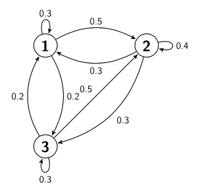

# Calculating transition probabilities by sampling

Consider the Markov chain that is illustrated in the transition graph below:

All the states in this chain are recurrent.  If you leave any one state there is a guarantee that you will return to it again at some point in the future.  Furthermore, if you start off in state `j` and you run the chain forward by `n` steps we can introduce a Bernoulli randomm variable that is 1 if we are in state `k` and 0 otherwise.  The p parameter of this Bernoulli random variable will be element `jk` of the `n`-step transition probability matrix. 

The aim of this exercise is to write a function to estimate the elements of the `n`-step transition probability matrix by sampling.  I would recommend that you start writing this function by noting that the transition matrix that corresponds to the chain above is:

You can thus set a variable `A` equal to this matrix by using the `np.array` command that was introduced in previous exercises.

To sample the chain you should write a function called `markov_move` that is similar to the function that you wrote for generating the next state in a Markov chain.  Just as in the previous exercises this function takes two arguments.  The first of these arguments, `trans`, should be the 1-step transition matrix for the Markov chain that is being simulated.  The second argument, `start`, is the state that the system is currently within.  Your function should generate the next state in the chain.

You can now write a function to generate the Bernoulli random variable described above.  In order to pass the test you will need to call this function `is_transition`.  Furthermore, this function should have four arguments:

* `trans` is the one-step transition probablity matrix
* `start` is the state that the chain begins within
* `nsteps` is the number of steps in the Markov chain that you are going to run
* `target` is the target state that you would like to end in

Within the function you should call `markov_move` `nsteps` time starting from state `start`.  Your function should then return 1 if the final state is state `target` and 0 otherwise.

The final function you should write should be called `sample_mean`.   This function should take five arguments:

* `trans`, should be the 1-step transition matrix for the Markov chain that is being simulated.  
* `start` is then state that the system starts within.  
* `nsteps` is the number of steps in the Markov chain that you are going to run 
* `target` is the target state that you would like to end in 
* `nsamples` should be the number of samples that are going to be generated by calling `is_transition`.  
 
Your `sample_mean` function should call `is_transition` `nsamples` times and thus generate `nsamples` samples of the Bernoulli random variable of interest.  You should calculate a sample mean and a sample variance from these `nsamples` copies of the random variable.  The function `sample_mean` should then return 2 arguments:

* `mean` - the sample mean that was obtained by calling `endstate` `nsamples` times
* `conf` - the 90% confidence limit around this estimate of the mean

You can calculate the confidence limit by using the ideas about the central limit theorem that were introduced in previous exercises.
